# self-attention

## the structure of self-attention
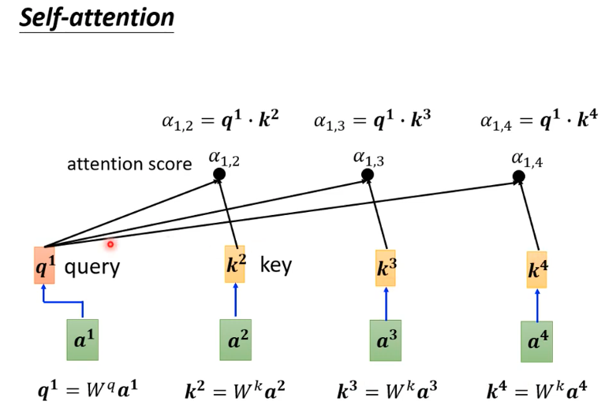
* attention means the relation between the input patches
* after calculationg the attention-score, we will normalize them with softmax or relu .etc and **we need to calculate the relation between query1 and itself key1**

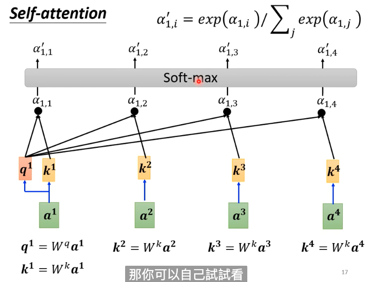

* then we can extract information according to the attention score and value

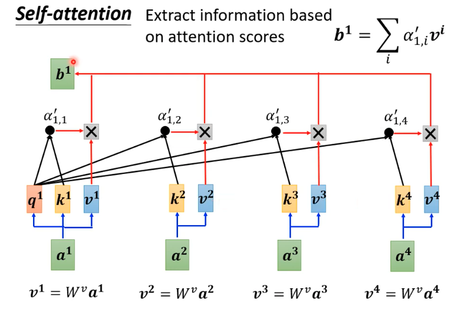

* besides, position encoding will show the sequence of the input seq

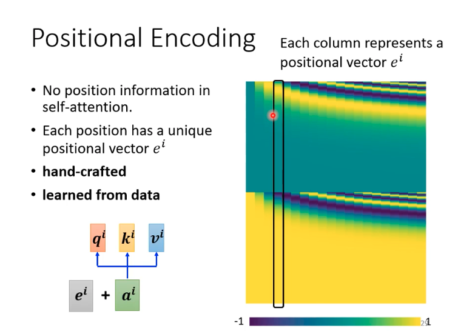

* self-attention matrix form

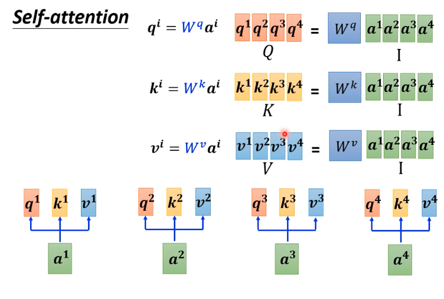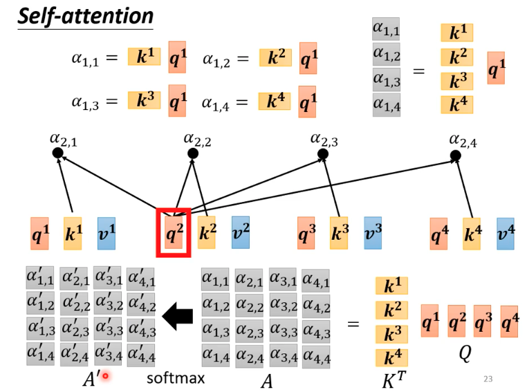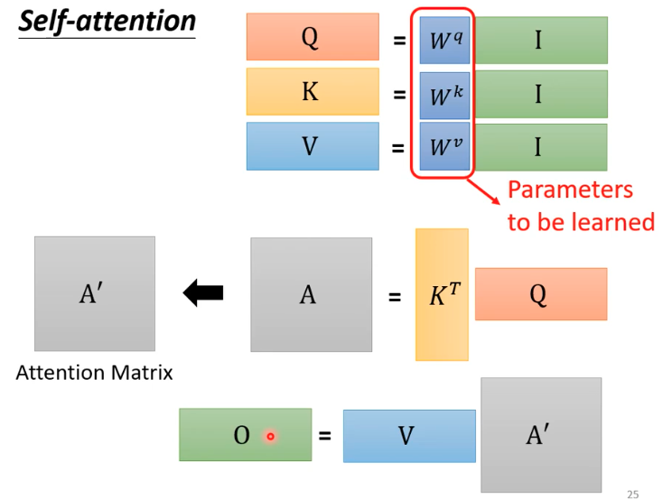

* multi head self-attention

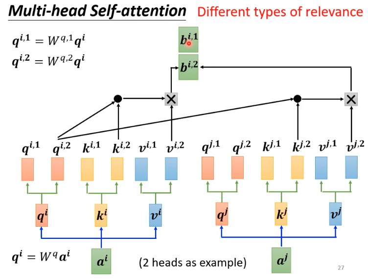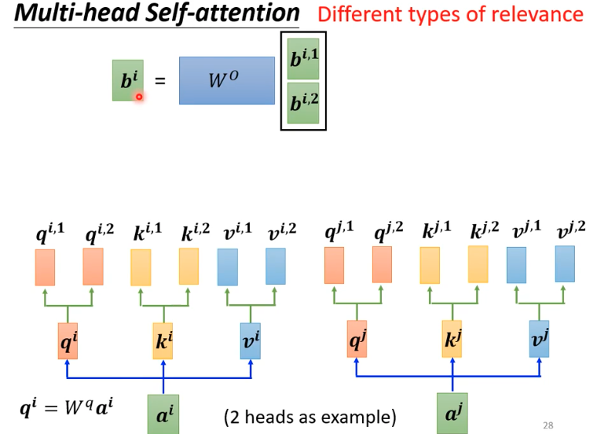

* there is a memory problem, because the calculate consumption is O(n^2), n is the length of input seq

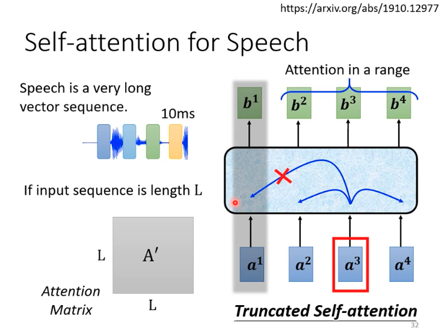

## relation between cnn and self-attetion
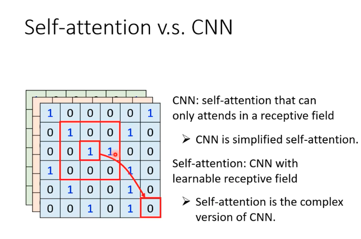
* a paper introduce how to transfer a transformer to cnn [*on the relationship between self-attention and convolutional layers*](https://arxiv.org/abs/1911.03584)
* cnn is a subset of attention, attention is more flexible, and easy to overfit. This means attention need more data, to avoid overfitting.
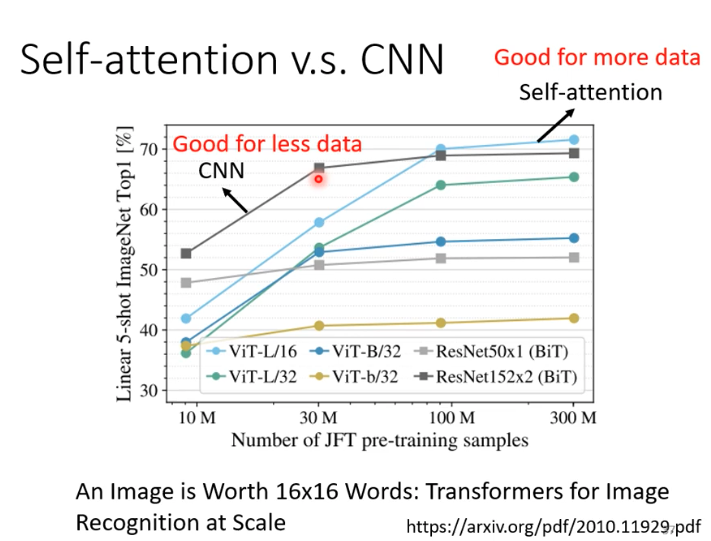
* when data is large, attention has a better performance. Cnn is good for less data.
* to do: how to reduce the memory of transformer [*Efficient Transformer: A survey*](https://arxiv.org/abs/2009.06732)
