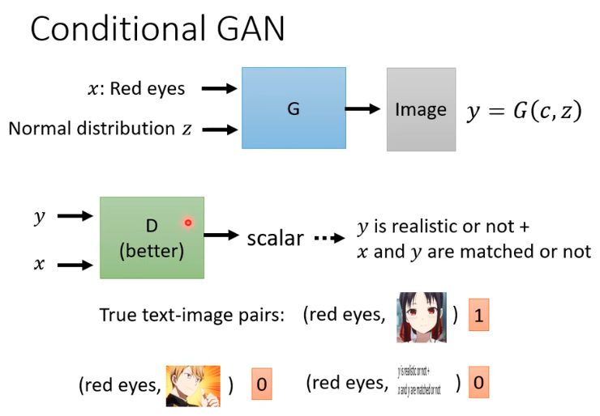

# Conditional GAN

## objective

* we can generate images with a text command to generate conditional images, for example we generate charactors with red eyes.

## discriminator

* we need the discriminator get text-iage pair samples with a scalar score.
* meanwhile, we will input text and distribution to Generator to generate image

## generate image

* we can input image and distribution to generator and get the full image, for example we input a structure of a building and generate the full image of the building
* but in many cases, we can not just use gan or supervised method, we mix this two methods up to get better performance.

## talking head

* we can input a image and a distribution to get the images talking some specific words, somehow like style transfer??

### we can alse input a sound to get a picutre, input an article to get abstract and etc
