# train and eval GAN

# training method

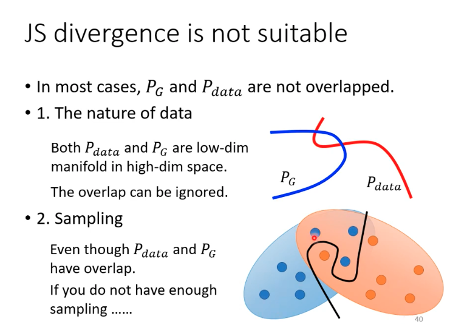

* for nature of data, the distribution is a low-dim mainfold in a high-dim space, which means natural distribution has very little overlaps
* sampling can not fully show the distribution, even though we take many samples

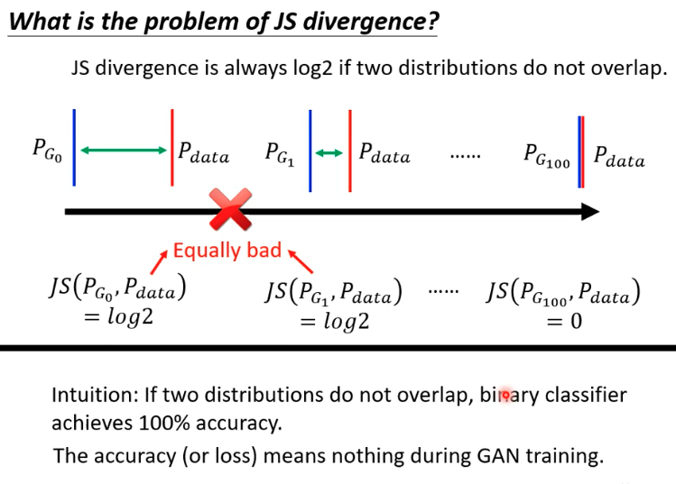

* in the picutre, the first two distribution have the same js divergence, but apparently the second one has better performance.
* besides, intutively, if two distributions do not overlap, bunary classifier achieves 100% accuracy, because discriminator can easily discriminate two samples. so the accuracy means nothing

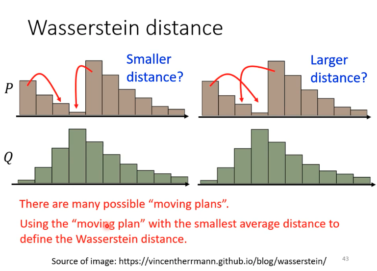

* the distance to move distribution P to Q, there are many moving plans and W-distance is the smallest moving distance.

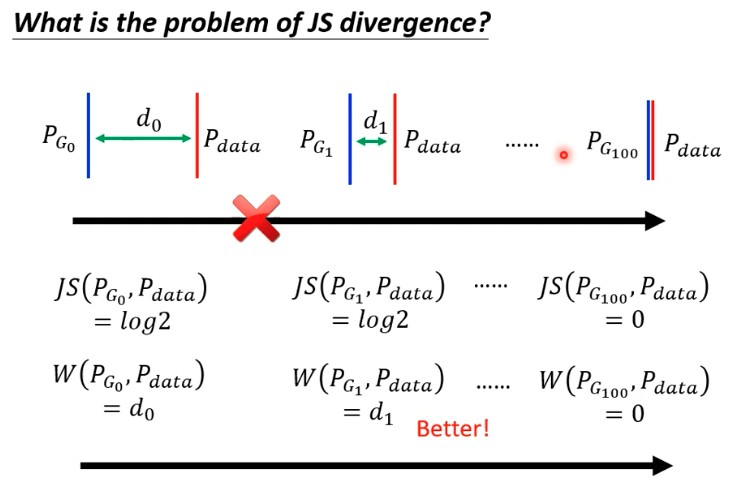

* for the same situation mentioned above, w-distance can show the difference between the first two distributions, while js can not.

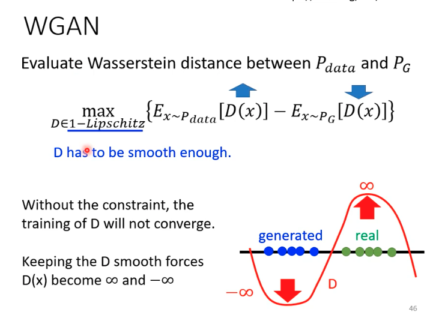

* this object function is a projection of the wasserstein distance.
* D need to be 1-lipschitz, which means D has to be smooth enough, otherwise, discriminator will force D(x) to infinity to be a good D. And then, the D will not converge no matter how many epochs of training.

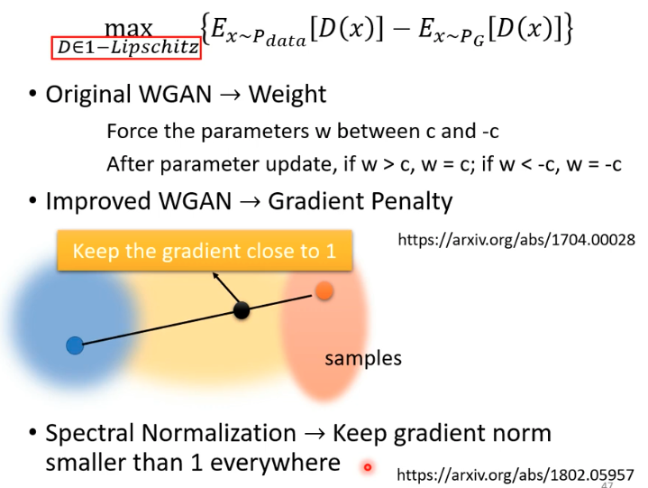

* to statisfy lipschitz, the best way is spectral nomalization.

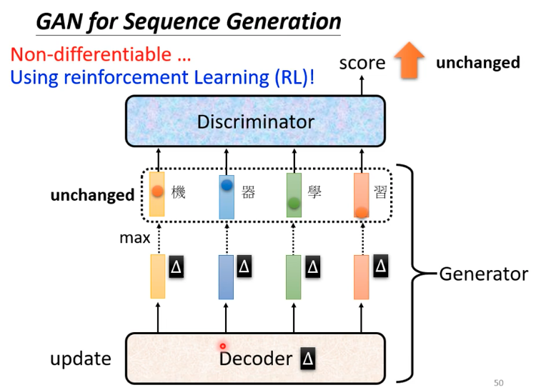

* for seq generation, there is a problem, that a little change in decoder(generator) the output token will not change so there will be no change for the discriminator.
* the token will not change, because the max probablily will not change will a little change in the generator.

## eval

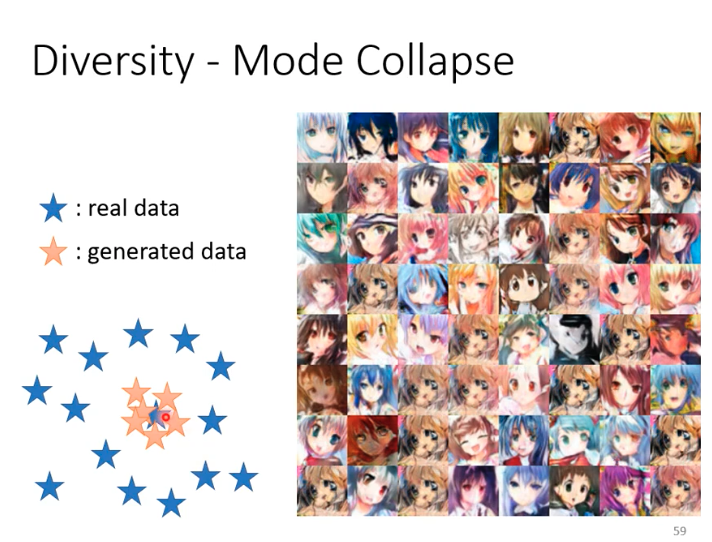

* sometimes, the distribution generated collapse, we generate very similar outputs but the real data has a very diverse distribution.

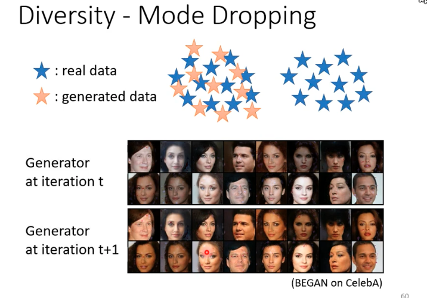

* sometimes, the generated distribution have very similar feature, for example the outputs at iter t all results are white-skin, while the results at iter t+1 are yellow-skin.

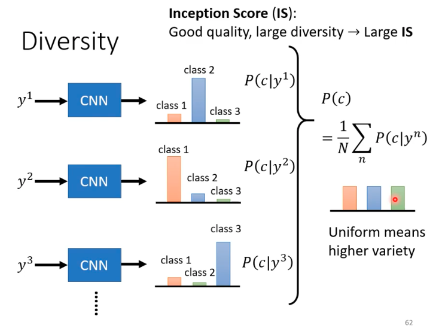

* a common way to evaluate the diversity is inception score, we want the probabilities of each catory are very close and the cnn has very high accuracy.

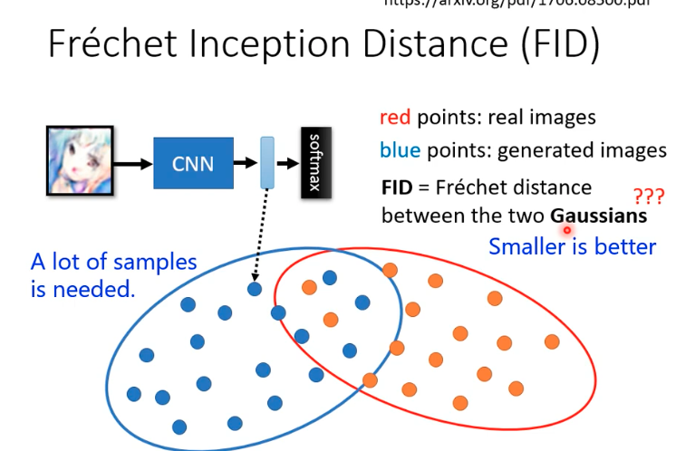

* for generative model. IS is not that suitable, because for face generation, the results are all face.
* FID is the Frechet inception distance of samples from the last hidden layer but not the results to avoid the above IS problem.

